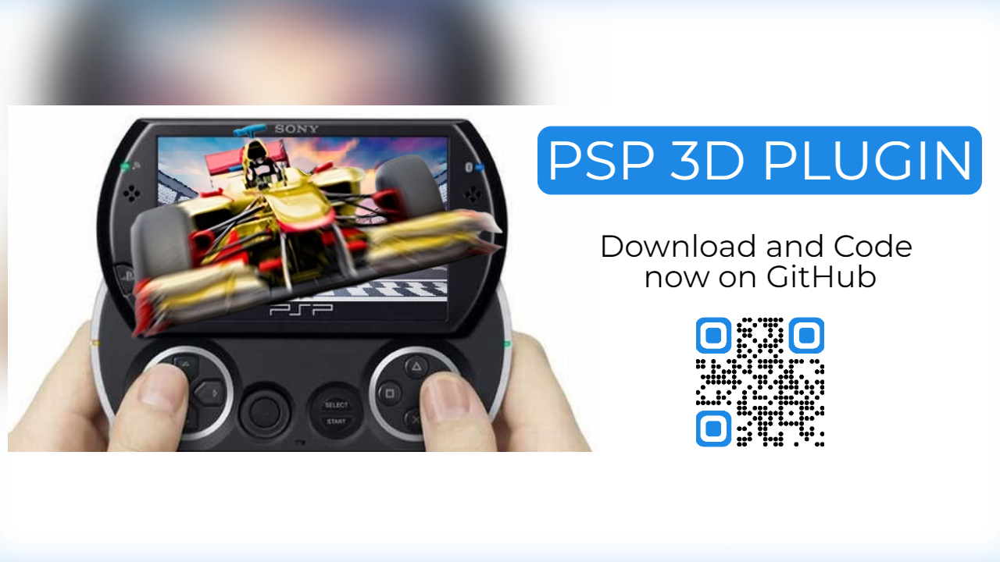

# PSP 3D Plugin

## This "Driver" allows to play games in Anagliph Stereoscopic 3D on your PSP or PSP Go! (Play Station Portable)

# 3D Features:
- Multiple Anagliph modes (red/cyan ...)
- Adjustable 3D disparity (intensity of 3D)
- Adjustable Convergence

# Pros:
- Stereoscopic 3D!
- Cheap!

# Cons:
- Increases resource usage and battery drain

# Compatibiles PSPs:
- You need a PSP with a custom firmware installed. (The most recent custom firmwares are TN-EN and PRO, up to PRO-B5. They are supported by the plugin. I suggest you to install the "temporary" version so the custom firmware unloads everytime you shut down the PSP completely).

# 3D "red/blue" Anagliph Glasses

# Supported Games

  
Click to show

   
- Ace Combat X | Compatible   
- Ape Escape | Compatible  
- Archer MacLean's Mercury | Compatible  
- Army of 2 - the 40th day | Flickers a lot  
- Army of TWO 40th Day | Compatible  
- Black Rock Shooter [JPN] | Compatible  
- Bubble Bobble Evolution | Compatible  
- Carnivores (PSN) | Compatible  
- Coded Arms Contagion | Compatible  
- Crush | Compatible  
- Dave Mirra BMX | Compatible  
- Dead Or Alive Paradise | Compatible  
- Dead to Rights: Reckoning | Compatible  
- Death Jr | Compatible  
- Dissidia 012 | Compatible  
- Dissidia Final Fantasy | Compatible  
- Enigmo | Compatible  
- Eragon | Compatible  
- FIFA 11 | Compatible  
- FIFA 12 | Compatible  
- Final Fantasy Crisis Core | Flickers  
- Final Fantasy IV Collection | Compatible  
- FTB2 (Socom USNavy Seals Fireteam Bravo 2) | Compatible  
- Full Metal Alchemist | Compatible  
- Gods Eater Burst | Flickers  
- Grip shift | Compatible  
- Idolm@ster SP: Missing Moon [JPN] | Compatible  
- Idolm@ster SP: Perfect Sun [JPN] | Compatible  
- Idolm@ster SP: Wandering Star [JPN] | Compatible  
- Jack and Daxter - The final frontier | Compatible  
- Jak and Daxter: The Lost Frontier | Compatible  
- Kingdom Hearts birth by sleep | Compatible  
- Lemmings | Compatible  
- Little Big Planet | Compatible  
- MediEvil: Resurrection | Compatible  
- Megaman Maverick Hunter | Compatible  
- Megaman Powered Up | Compatible  
- Metal Gear Solid - Opps and Opps + | Compatible  
- Monster Hunter Freedom | Compatible  
- Monster Hunter Freedom 2 | Compatible  
- Monster Hunter Freedom Unite | Compatible  
- Motorstorm Artic Age | Compatible  
- Naruto Ultimate Ninja Heroes | Compatible  
- Naruto Ultimate Ninja Heroes 2 | Compatible  
- NHL 7 | Compatible  
- Over The Hedge Hammy Goes Nuts | Compatible  
- Patapon | Compatible  
- Patapon 2 | Compatible  
- Phantom Brave | Compatible  
- Prince of Persia - Revelations | Compatible  
- Prince of Persia - Rival Swords | Compatible  
- Prinny Can I Really Be The Hero? | Compatible  
- Ratchet & Clank - Size Matters | Compatible  
- Ridge Racer 2 | Compatible  
- Ridge Racer | Compatible  
- Secret Agent Clank | Compatible  
- Siphon Filter - Dark Mirror | Compatible  
- Soul Calibur Broken Destiny | Compatible  
- Spiderman Friend Or Foe | Compatible  
- Star Wars Battlefront - Elite Squadron | Compatible  
- Star Wars Battlefront II | Compatible  
- The 3rd birthday | Compatible  
- The Eye of Judgment Legends | Compatible  
- Transformers | Compatible  
- Transformers Revenge Of The Fallen | Compatible  
- Tomb Raider - Legends | Flicker a little  
- Turtles | Compatible  
- Undead Knight | Compatible  
- Ultimate Ghost And Goblin | Compatible  
- Vulcanus - Seek and Destroy | Compatible  
- Wipeout Pulse | Compatible  
- Wipeout Pure | Compatible  
- Worms² | Compatible  
- Young Thor | Compatible  
- Yu-Gi-Oh! Tag Force | Compatible  
- ... more!  

# Plugin Download
Download Last Release v2.2 here!

# How to install the 3D Plugin:  

  
Click to show

   
- Download the 3D Plugin .zip archive from this page  
- Extract the plugin into the root folder of your PSP  
- If you have a PSP, Open the game.txt file and add this line: ms0:/seplugins/psp3d.prx 1  
- Instad, if you have a PSP Go, Open the game.txt file and add this line: ef0:/seplugins/psp3d.prx 1  
- Deactivate PSP HUD  
- Deactivate Custom Home Plugin  
- Open the 3D menu pressing the musical note key on the PSP  
  

# Credits
- Developer: PSPWizard (aka AnMaBaGiMa)
- This documentation: Mik-el (me). I hope this repo will bring some new love to 3D and to the PSP. 

# My Social pages
|  |  |
| ------ | ------ |
| Telegram Channel | [link][tg] |
| XDA Forum | [link][xda] |
| Tech Blog | [link][cam] |
| Instagram | [link][insta] |
| Youtube | [link][yt] |

[xda]: <http://bit.ly/2NBnhqB>
[insta]: <http://bit.ly/mikel_insta>
[yt]: <http://bit.ly/mikel_YT>
[paypal]: <https://paypal.me/donationMikel>
[cam]: <http://bit.ly/2mffw0h>
[tg]:<https://bit.ly/Mikel_TG>
